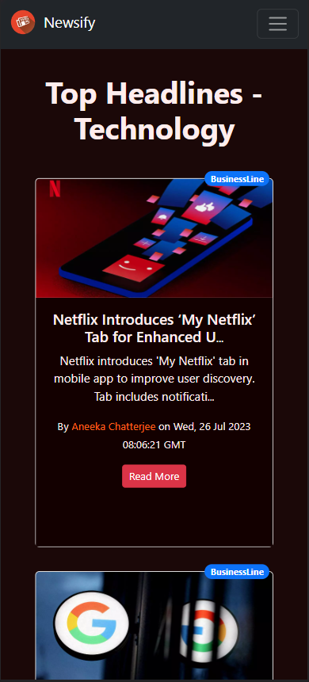
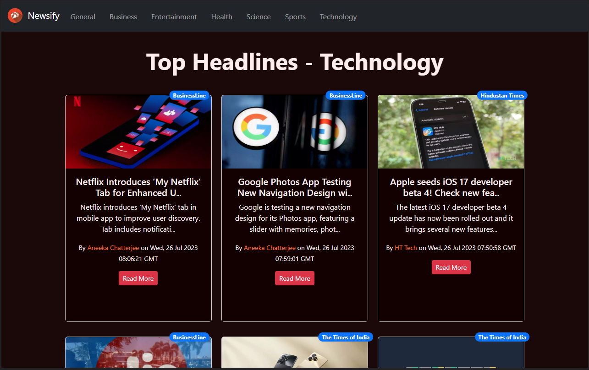

# Newsify

**A news app built using ReactJS, Bootstrap and NewsAPI**

Newsify is a News Web App, where user can view the news based on different categories which are:

- General
- Business
- Entertainment
- Health
- Science
- Sports
- Technology

## Home Page | General

## Technology

If the user wants to read the complete news, they can simply click on the `Read More` button, which will redirect them to the website where the news is being fetched from.

For Example, if the user clicked on the `Read More` button on the *Google Photos App* news, they'll be redirected to this page:

The user can read news from whatever category they like simply by clicking on the different categories mentioned on the navbar.

## Infinite Scroll

**Newsify** features infinite scroll, which means the user can keep on scrolling the news page, and more news will continue to load until no more news on the particular category is left.

## Fully Responsive

**Newsify** is fully responsive, meaning that it can be accessed on any device, of any dimensions, and the user experience would still be absolutely amazing.

## License